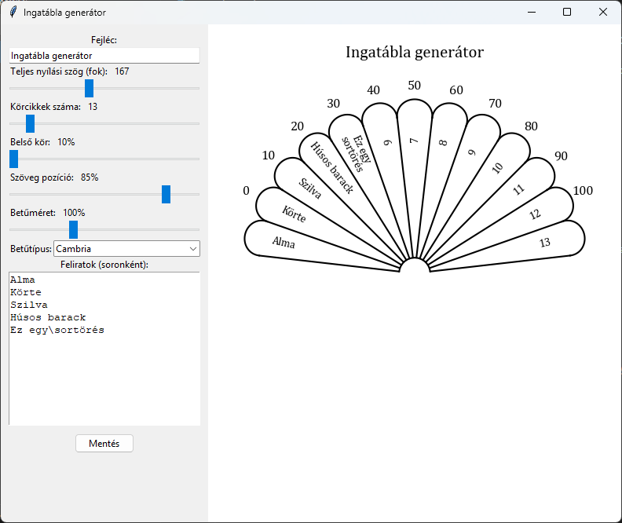

# Ingatábla generátor

Ez az alkalmazás egy egyszerű interaktív grafikus eszköz, amellyel egyedi, legyező-szerű ingatábla ábrákat lehet készíteni, testreszabható feliratokkal és beállításokkal.



## Letöltés

[Ezen a linken](https://github.com/Deybacsi/inga-generator/releases/latest) letöltheted a közvetlenül Windowson futtatható változatot. (Inga-generator.exe)

Ha nem akarsz ész nélkül mindenféle ismeretlen programot futtatni a gépeden, akkor, töltsd fel az .exe-t a [VirusTotal.com](https://www.virustotal.com/)-ra. Itt kb 30 különböző vírusírtó programmal ellenőrizheted, hogy biztonságos-e ;)

## Fő funkciók

- **Körcikkek száma**: Állítható, hogy hány szekcióból álljon a tábla
- **Teljes nyílási szög**: Meghatározható, hogy mekkora teljes szögben jelenjen meg a kör
- **Belső kör mérete**: A középső üres rész aránya állítható
- **Szöveg pozíció**: A feliratok távolsága a középponttól
- **Betűméret**: A belső feliratok mérete szabadon állítható
- **Betűtípus**: A számítógépen elérhető összes telepített betűtípus közül választható
- **Feliratok**: Minden körcikkhez külön felirat adható meg, a `\` (AltGr+Q) karakterrel sortörés is lehetséges
- **Azonnali előnézet**: Minden módosítás azonnal megjelenik a jobb oldali előnézeti ablakban

## Használat

1. Állítsd be a kívánt paramétereket a bal oldali panelen
2. Írd be a feliratokat soronként, szükség esetén használj `\` karaktert sortöréshez
3. Az előnézet mindig automatikusan frissül
4. Az elkészült ábrát a "Mentés" gombbal tudod elmenteni PNG, JPG vagy PDF formátumban

## Rendszerkövetelmények

- Windows operációs rendszer (más rendszereken is működhet, lásd a kódban)
- Python 3.8 vagy újabb
- Szükséges csomagok: `tkinter`, `matplotlib`, `numpy`

Csomagok telepítéséhez:
```
pip install matplotlib numpy
```
A `tkinter` a legtöbb Python telepítésben alapból benne van.

## Fordítás futtatható .exe-re

Ha nem szeretnél Python-t telepíteni, a [releases oldalon letölthető](https://github.com/Deybacsi/inga-generator/releases/latest) előre lefordított Windows .exe verzió is.

Saját fordításhoz ajánlott a [PyInstaller](https://pyinstaller.org/) használata:
```
pip install pyinstaller
pyinstaller --onefile --noconsole generator.py
```

